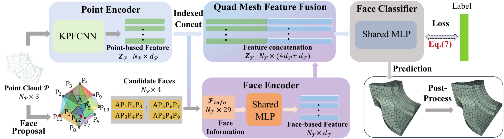
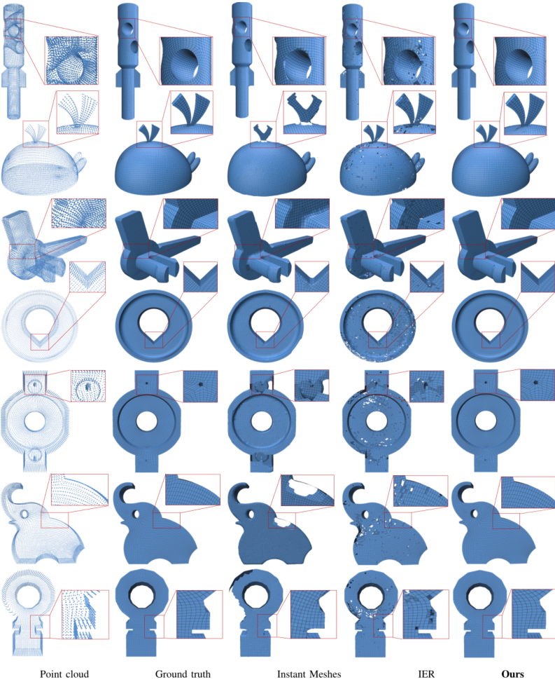

# Point2Quad
**Point2Quad: Generating Quad Meshes from Point Clouds via Face Prediction**

## Introduction

In this repository, we release the code for Point2Quad, a learning-based method for quad-only mesh generation from point clouds. The key idea is learning to identify quad mesh with fused pointwise and facewise features. Specifically, Point2Quad begins with a k-NN-based candidate generation considering the coplanarity and squareness. Then, two encoders are followed to extract geometric and topological features that address the challenge of quad-related constraints, especially by combining in-depth quadrilaterals-specific characteristics. Subsequently, the extracted features are fused to train the classifier with a designed compound loss. The final results are derived after the refinement by a quad-specific post-processing. Extensive experiments on both clear and noise data demonstrate the effectiveness and superiority of Point2Quad, compared to baseline methods under comprehensive metrics. 

### Update 29/03/2025: New [PyTorch implementation](https://github.com/cognaclee/Point2Quad) available. 


## Citation
If you find our work useful in your research, please consider citing:

```
@inproceedings{li2025nopain,
  title={NoPain: No-box Point Cloud Attack via Optimal Transport Singular Boundary},
  author={Li, Zezeng and Du, Xiaoyu and Lei, Na and Chen, Liming and Wang, Weimin},
  booktitle={Proceedings of the IEEE/CVF Conference on Computer Vision and Pattern Recognition},
  year={2025}
}
```

## Installation

A step-by-step installation guide for Ubuntu 16.04 is provided in [INSTALL.md](./INSTALL.md). Windows is currently 
not supported as the code uses tensorflow custom operations.


## Performances

We provide scripts for many experiments. The instructions to run these experiments are in the [doc](./doc) folder.




## Usage

### Setup Environment


1. **Clone the repository and navigate to the project directory:**

   ```bash
   git clone https://github.com/cognaclee/Point2Quad.git
   cd Point2Quad
   ```
2. **Create and activate the environment using the provided YAML file:**
	```
	# Create the environment based on Point2Quad.yaml
	conda env create --file Point2Quad.yaml --name Point2Quad
	# Activate the environment
	conda activate Point2Quad

	```

### Prepare Data and Models

1. **Download the datasets and place them in the `data/` directory:**

	```
	data/
	├── shapenetcore_partanno_segmentation_benchmark/
	├── ScanObjectNN/
	└── modelnet40_normal_resampled/
	```
2. **Download the [pretrained models](https://drive.google.com/drive/folders/1K0i1Q-77maDBT03fSGRQzHXA1bvgNSD5?usp=drive_link) and place them in the `pretrained/` directory:**
	```
	# Create the pretrained directory if it doesn't exist
	mkdir -p pretrained
	```

### Run Point2Quad
This example demonstrates an 
1. **Train**
    Set ```point2QuadrilateralConfig.data_dir``` as **your data path**, then
	```bash
	python train.py
	```
3. **Test**
	```bash
	# If you want to use a pretrained OT, run the following command
	# Replace `<your directory>` and `<your_ot.pt>` with your specific paths
	python test_models.py
	```

## Acknowledgment

Our code uses <a href="https://github.com/HuguesTHOMAS/KPConv">KPConv</a> as the backbone.

## License
Our code is released under MIT License (see LICENSE file for details).

